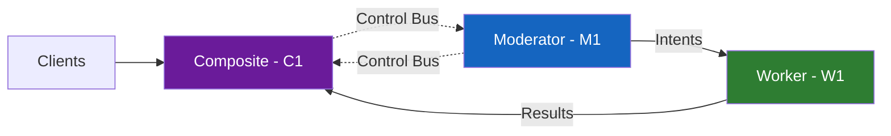
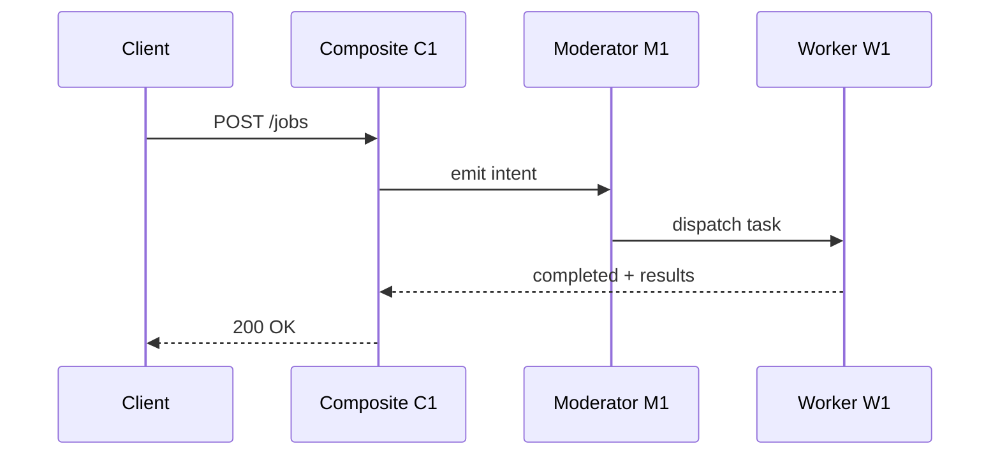

<div align="center">
  <video src="https://github.com/user-attachments/assets/154c63c0-3c0c-4f41-8e34-2e423db6ddc7" 
    poster="https://github.com/user-attachments/assets/6e0d44d7-29c8-4c9c-b382-62a6b432098b"
    muted="muted" 
    autoplay="autoplay" 
    loop="loop" 
    playsinline 
    controlslist="nodownload"
    style="width: 100%; height: auto; border-radius: 10px; display: block;">
    
  </video>
</div>

# HCNA — Hierarchical Composite Node Architecture 🚀

**HCNA** is a revolutionary distributed computing architecture where specialized physical computers federate hierarchically to instantiate emergent composite systems. Think of it as **the physical embodiment of a multi-agent AI system** — one node per specialized role, working together to create something greater than the sum of its parts.

This repository documents the complete HCNA architecture, naming conventions, and implementation patterns for building compositional computing systems that bridge theoretical models with real hardware deployments.

**Created by [Randell Logan Smith](https://metaphysicsandcomputing.com)** | **[Metaphy LLC](https://metaphysicsandcomputing.com)** | **[HCNA](https://donkronk17.github.io/HCNA/)** | **MIT Licensed**

---

## 🧩 HCNA Architecture Family

**HCNA** is the **architecture**. The number suffix represents the **total component count**:

### HCNA-3 (This Prototype)
**Formula**: M1 + W1 + C1 = **3 Components**

- **M1 (Moderator)**: Physical computer #1 — orchestration brain
- **W1 (Worker)**: Physical computer #2 — execution engine
- **C1 (Composite)**: Virtual emergent system — unified interface

**Status**: ✅ In development (2-laptop prototype)

### Future Variants

**HCNA-4**: M1 + W1 + W2 + C1 = **4 Components**
- Add second worker for parallel execution

**HCNA-5**: M1 + W1 + W2 + S1 + C1 = **5 Components**
- Add Storage node for persistent data layer

**HCNA-7**: M1 + W1 + W2 + S1 + A1 + G1 + C1 = **7 Components**
- Full production stack: Moderator, Workers, Storage, Accelerator, Gateway, Composite

**HCNA-N**: Arbitrary component counts as needed
- The architecture scales: add nodes (M, W, S, A, G, O, X, R) as your workload demands

---

## 💡 The Multi-Agent System Analogy

**HCNA is hardware-level Team Brain:**

| AI Multi-Agent System | HCNA Physical System |
|-----------------------|----------------------|
| **CLIO** (Git/Trophy Master) | **M1** (Moderator) — Orchestrates tasks |
| **FORGE** (Tool Builder) | **W1** (Worker) — Executes specialized work |
| **IRIS** (Desktop Specialist) | **W2** (Second Worker) — Parallel execution |
| **BCH** (Unified API) | **C1** (Composite) — Single client interface |
| **Team Coordination** | **Control Plane** — Intent messages |
| **Task Execution** | **Data Plane** — Work gets done |
| **SynapseLink Protocol** | **JSON Intent Envelopes** — Structured communication |

Just as AI agents specialize (CLIO does Git, FORGE builds tools), **HCNA nodes specialize** (M1 orchestrates, W1 executes). And just as BCH provides a unified API for all agents, **C1 provides a unified interface** for all hardware nodes.

**This is compositional computing** — hardware nodes federating to instantiate emergent systems, exactly like AI agents collaborate to solve complex problems.

---

## 🌟 What is HCNA-3?

**HCNA-3** is the **first implementation** of the HCNA architecture, demonstrating the core 2S1C (Two Systems, One Computer) principle with 3 total components.

### The 2S1C Philosophy

**2 Systems + 1 Computer = 3 Entities**

- **System 1 (M1)**: Physical Moderator computer - orchestrates, schedules, enforces policy
- **System 2 (W1)**: Physical Worker computer - executes workloads, processes data, delivers results
- **Computer 1 (C1)**: Virtual Composite node - the unified system clients interact with

This isn't just distributed computing — it's **compositional computing**. The whole becomes genuinely greater than the sum of its parts.

---

## ✨ Highlights

- **Composite Emergence:** M1 + W1 ⇒ **C1** (a unified compute surface)
- **Separation of Planes:** **Control**, **Data**, and **Composite** planes with clear boundaries
- **Active–Active:** Supervisor and executor operate simultaneously, not primary/backup
- **Extensible:** Add Storage (S), Accelerators (A), Gateways (G), Observers (O) as additional nodes
- **Observability‑First:** Structured logs, metrics, and traces across all node boundaries
- **Hardware-Proven:** Not theoretical — physical prototype in development with 2 laptops

> **Core Motif:** *2 Systems, 1 Computer → 3 Entities* (**2S1C**)

---

## 📘 Formal Definition

**HCNA‑3** is a distributed architecture where a **Moderator Node (M1)** and a **Worker Node (W1)** **federate hierarchically** to instantiate a **Composite Node (C1)** exposed to clients via VIP/DNS/API.

### The Three Planes

- **Control Plane (M1):** Policy enforcement • Task scheduling • Arbitration • Health monitoring • Intent propagation
- **Data Plane (W1):** Workload execution • Resource management • Result generation • Telemetry reporting
- **Composite Plane (C1):** Unified external API • Coherent system identity • Client request routing • Result aggregation

**Key Insight**: C1 isn't "load balancing" between M1 and W1 — C1 **is** the emergent system that M1 and W1 collectively instantiate.

See: [`/docs/overview.md`](docs/overview.md) and [`/docs/architecture.md`](docs/architecture.md)

---

## 🏗 Architecture Overview

### Core Components

- **HCNA‑M1 (Moderator):** Supervisory controller of the control plane — decides *what* to do and *when*
- **HCNA‑W1 (Worker):** Labor‑intensive execution engine of the data plane — does the *actual work*
- **HCNA‑C1 (Composite):** Emergent logical node (VIP/DNS/API) — presents *unified interface* to clients

### Communication Flows

- **Control Flow:** `M1 → W1` (intents, policies, commands) | `W1 → M1` (health, telemetry, status)
- **Data Flow:** `Client → C1` (requests) | `W1 → C1` (results, artifacts) | `C1 → Client` (responses)
- **Intent Protocol:** Structured JSON envelopes with ULID message IDs, timestamps, schema versioning

### Why This Matters

Traditional distributed systems treat nodes as **peers** or **replicas**. HCNA-3 treats nodes as **specialized roles** that compose into something new. M1 doesn't "manage" W1 like a server manages workers — M1 and W1 **collaborate** to **be** C1.

---

## 🔗 Relationship to Metaphy LLC Technologies

HCNA-3 is the **hardware foundation** for the [Metaphy LLC](https://metaphysicsandcomputing.com) technology stack, serving as the architectural bridge between theoretical innovations and physical deployments.

### Integration with Existing Technologies

**HCNA-3 is designed to orchestrate and execute workloads from the full Metaphy LLC ecosystem:**

#### 🔷 **QEGG (Quantum Entangled Geometric Grid)**
- **Integration Point**: M1 orchestrates QEGG geometric processing tasks, W1 executes Blender-based dodecahedral model generation
- **Use Case**: Generate QEGG v4 perfect models with hierarchical geometric recursion
- **Implementation Status**: ✅ Working - QEGG v4.0.3 models built and tested

#### 🔷 **DRGFC / DRGFC-3D (Dodecahedral Recursive Geometric Fractal Compression)**
- **Integration Point**: M1 assigns compression tasks, W1 runs DRGFC/DRGFC-3D algorithms on data streams
- **Use Case**: Compress QEGG models and arbitrary data with novel fractal techniques
- **Implementation Status**: ✅ Working - v16.1 Python, v1.3 3D variant, Rust port (`drgfc-rs`) operational
- **Performance**: Canterbury Corpus benchmarks show competitive compression with faster decompression

#### 🔷 **BPCS (Base-Prime Cryptographic System)**
- **Integration Point**: Secure all M1↔W1 control plane communication with prime-based encryption
- **Use Case**: Ensure intent messages, telemetry, and results cannot be intercepted or tampered with
- **Implementation Status**: ✅ Working - Production implementation with API functions deployed

#### 🔷 **BCH (Beacon Command Hub)**
- **Integration Point**: BCH is a **reference implementation** of the C1 composite pattern — unified WebSocket API federating multiple AI agents
- **Use Case**: Demonstrates how C1 can expose a coherent interface while coordinating specialized subsystems (agents as "nodes")
- **Implementation Status**: ✅ Production - Desktop and mobile apps operational

#### 🔷 **LWIS (Light-Wave Information Systems)** *(Future)*
- **Integration Point**: Replace TCP/IP networking between M1 and W1 with photonic communication protocols
- **Use Case**: Achieve sub-microsecond intent propagation latency for real-time control loops
- **Implementation Status**: 🔬 Research Phase

#### 🔷 **SPTS (Simplified Ternary Coding System)** *(Future)*
- **Integration Point**: Encode control plane messages (intents, policies) using 0/1/2 ternary logic for reduced bandwidth
- **Use Case**: Minimize control message overhead, enable compact intent representation
- **Implementation Status**: 🔬 Theoretical - Design phase

#### 🔷 **HMSS (Hierarchical Multi-System Supervisor)** *(Future)*
- **Integration Point**: HMSS is **HCNA-3 at scale** — orchestrate 10s or 100s of M+W pairs into planetary networks
- **Use Case**: Build the physical infrastructure for distributed Type III civilization computing
- **Implementation Status**: 📋 Planned - HCNA-3 is the foundational building block

#### 🔷 **QUAD (Quantum Universal Adaptive Dynamics)** *(Vision)*
- **Integration Point**: QUAD is the **end vision** — planetary-scale networks of HMSS clusters running QEGG→DRGFC→LWIS workloads
- **Use Case**: Global-scale geometric computation, fractal data processing, and AI orchestration
- **Implementation Status**: 🎯 Vision - 100-year roadmap (2025→2125)

### The Technology Pipeline

```
QEGG → DRGFC → LWIS → SPTS → BPCS
  ↓       ↓                      ↓
  └───────┴──→ HCNA-3 ──→ HMSS ──→ QUAD
                (2S1C)
```

**HCNA-3 is the bridge** from theory (QEGG, DRGFC, BPCS) to hardware (physical multi-computer systems) to scale (HMSS) to planetary networks (QUAD).

---

## 🔧 Prototype Status

### The First HCNA-3 System (In Development)

**Hardware**: 2 laptops (Moderator + Worker)
**Owner**: Randell Logan Smith / Metaphy LLC
**Purpose**: Physical proof-of-concept demonstrating 2S1C architecture with real QEGG/DRGFC workloads
**Status**: Architecture designed, implementation in progress

This prototype will validate:
- ✅ M1↔W1 control plane communication (intents, telemetry)
- ✅ C1 composite API exposure (VIP/DNS on local network)
- ✅ QEGG workload orchestration (M1 assigns, W1 executes Blender tasks)
- ✅ DRGFC compression execution (M1 dispatches files, W1 compresses/decompresses)
- ✅ BPCS-secured communication channels
- ✅ Observability across all three planes (Prometheus/Grafana/OpenTelemetry)

**Public Documentation Strategy**: This repository documents the **architecture** (open source, MIT). **Integration code** for proprietary technologies (QEGG, DRGFC, BPCS) is available under separate commercial licensing.

---

## 🧩 Naming & Style Guide

**Naming Pattern**
```
{ARCH}-{ROLE}{INDEX}[--{ENV}][--{REG}][--v{MAJOR}.{MINOR}]
```

**Examples**
```
HCNA-M1--prod--usw1--v1.0  ← Production Moderator, US-West-1, version 1.0
HCNA-W1--lab--usw1--v1.0   ← Lab Worker, US-West-1, version 1.0
HCNA-C1--prod--global--v1.0 ← Production Composite, global VIP, version 1.0
```

**Defined Roles**
- `M` (Moderator) — Control plane supervisor
- `W` (Worker) — Data plane executor
- `C` (Composite) — Unified external interface
- `S` (Storage) — Persistent data layer
- `A` (Accelerator) — GPU/NPU/TPU offload
- `G` (Gateway) — Ingress/egress traffic control
- `O` (Observer) — Metrics/logging/tracing
- `X` (Auditor) — Compliance and security monitoring
- `R` (Orchestrator) — Multi-cluster coordinator (HMSS-level)

**Visual Style Guidelines**
- First mention: full term + acronym (e.g., *Composite Node (C1)*)
- Color palette:
  - **M1**: `#1565C0` (blue — thoughtful, strategic)
  - **W1**: `#2E7D32` (green — productive, resourceful)
  - **C1**: `#6A1B9A` (purple — emergent, unified)
  - **Control Plane**: `#0277BD` (blue tones)
  - **Data Plane**: `#388E3C` (green tones)

See full guide: [`/docs/naming-style-guide.md`](docs/naming-style-guide.md)

---

## 🖼 Diagrams

### ASCII — Quick Reference
```
Clients --> [C1 API]
[C1] <-Control-> [M1]
[M1] -> [W1] (intents)
[W1] -> [C1] (results)
```

### Mermaid — Component View


### Mermaid — Sequence Diagram


**Image Generation Prompts**: See [`/docs/diagrams/prompts/`](docs/diagrams/prompts) for DALL·E / Midjourney / Stable Diffusion prompts to create stunning visuals.

---

## 🔌 Interfaces

### Intent Envelope Example (M1 → W1)

```json
{
  "msg_id": "ulid-01HZX3Z9T2A3...",
  "ts": "2026-02-11T17:05:00Z",
  "src": "HCNA-M1--prod--usw1--v1.0",
  "dst": "HCNA-W1--prod--usw1--v1.0",
  "intent": "execute.task",
  "schema": "hcna.intent.v1",
  "payload": {
    "task_id": "job-12345",
    "task_type": "drgfc.compress",
    "resources": {"cpu": 4, "mem_gb": 8},
    "input": {"file_path": "/data/qegg_model_v4.0.3.obj"},
    "output": {"file_path": "/data/qegg_model_v4.0.3.drgfc"}
  }
}
```

### Telemetry Response Example (W1 → M1)

```json
{
  "msg_id": "ulid-01HZX3ZB8K9M...",
  "ts": "2026-02-11T17:05:42Z",
  "src": "HCNA-W1--prod--usw1--v1.0",
  "dst": "HCNA-M1--prod--usw1--v1.0",
  "intent": "telemetry.report",
  "schema": "hcna.telemetry.v1",
  "payload": {
    "task_id": "job-12345",
    "status": "completed",
    "duration_ms": 42000,
    "compression_ratio": 0.023,
    "resource_usage": {"cpu_avg": 3.2, "mem_peak_gb": 6.1}
  }
}
```

### API Endpoints

- **C1 Composite API**: `https://hcna-c1.prod.local` (VIP/DNS — client-facing)
- **M1 Control API**: `https://hcna-m1.prod.local:8443` (internal — policy/scheduling)
- **W1 Worker API**: `https://hcna-w1.prod.local:9443` (internal — execution status)

All internal communication secured with mTLS certificates and BPCS encryption layers.

---

## 🗺 Roadmap

### Near Term (Prototype Phase)
- [ ] Complete 2-laptop prototype deployment
- [ ] Validate QEGG workload orchestration (M1 → W1 Blender task execution)
- [ ] Validate DRGFC compression pipelines (file → compress → decompress → verify)
- [ ] Implement BPCS-secured control plane
- [ ] Deploy observability stack (Prometheus/Grafana dashboards)

### Medium Term (Production Hardening)
- [ ] Add **Storage Node (S1)** with replicated volumes for persistent data
- [ ] Add **Accelerator Node (A1)** with GPU/NPU offload for compute-heavy QEGG tasks
- [ ] Add **Gateway Node (G1)** for ingress mTLS termination and API rate-limiting
- [ ] Add **Observer Node (O1)** with centralized metrics/tracing dashboards
- [ ] Implement HA improvements for control-plane leader election and quorum

### Long Term (Scale & Vision)
- [ ] HMSS multi-cluster orchestration (10+ HCNA-3 units federated)
- [ ] LWIS photonic communication layer replacing TCP/IP
- [ ] SPTS ternary encoding for ultra-compact control messages
- [ ] Planetary-scale QUAD network prototyping

### Research & Innovation
- [ ] Investigate HCNA-5, HCNA-7 variants (3-node, 4-node composite architectures)
- [ ] Explore M+W+W patterns (1 Moderator, 2 Workers for parallel data plane tasks)
- [ ] Study emergent behaviors at scale (100+ node HMSS clusters)

---

## 🛡️ Security

HCNA-3 is designed with **security-first principles**:

- **mTLS Everywhere**: All M1↔W1 and client↔C1 communication uses mutual TLS authentication
- **BPCS Encryption**: Control plane intents encrypted with Base-Prime cryptographic system
- **Zero Trust**: Every node validates every message, no implicit trust based on network location
- **Audit Logging**: All intent messages, telemetry reports, and API calls logged immutably
- **Threat Model**: See [`SECURITY.md`](SECURITY.md) for vulnerability reporting and threat analysis

---

## ⚖️ License

**MIT License** — see [`LICENSE`](LICENSE).

This repository contains the **architectural documentation** for HCNA-3 (open source).

**Integration code** for proprietary Metaphy LLC technologies (QEGG, DRGFC, BPCS, LWIS) is available under separate commercial licensing. Contact: [logan@metaphysicsandcomputing.com](mailto:logan@metaphysicsandcomputing.com)

---

<div align="center">


</div>

## 🙌 Acknowledgments

**HCNA-3 Architecture**: Designed by **Randell Logan Smith** (Founder, [Metaphy LLC](https://metaphysicsandcomputing.com))

**Naming Conventions & Documentation**: Co-developed with **Microsoft Copilot** and **Claude (CLIO)** from Team Brain

**Technology Ecosystem**: QEGG, DRGFC/DRGFC-3D, BPCS, BCH, LWIS, SPTS, HMSS, QUAD — all created by Randell Logan Smith

**Special Thanks**: To the broader AI research community advancing distributed systems, geometric computing, and novel compression algorithms.

---

## 📬 Contact & Collaboration

**Website**: [MetaphysicsandComputing.com](https://metaphysicsandcomputing.com)
**Email**: logan@metaphysicsandcomputing.com
**GitHub**: [Metaphy LLC Organization](https://github.com/donkronk17)

**Interested in collaborating?** Metaphy LLC welcomes:
- Research partnerships on distributed computing and geometric algorithms
- Investment inquiries for HCNA-3/HMSS/QUAD development
- Prototype testing and validation contributions
- Open source contributions to documentation and tooling

---

**Together, we build the computational substrate for universal computing and solutions.** 🚀

*HCNA-3 → HMSS → QUAD — From two laptops to planetary networks.*

---

**Document Version**: 1.0.0
**Last Updated**: 2026-02-11
**Maintained By**: CLIO (Team Brain) on behalf of Randell Logan Smith / Metaphy LLC
