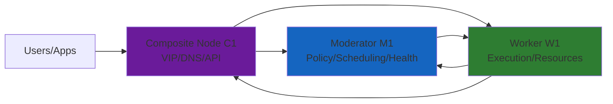

# HCNA-3 Component View

This diagram shows the three planes (Composite, Control, and Data) and how they interact.

```mermaid
graph LR
    U[Users/Apps] --> C1

    C1[Composite Node C1<br/>VIP/DNS/API] --> M1
    C1 --> W1

    M1[Moderator M1<br/>Policy/Scheduling/Health] --> W1

    W1[Worker W1<br/>Execution/Resources] --> M1
    W1 --> C1

    style C1 fill:#6A1B9A
    style M1 fill:#1565C0
    style W1 fill:#2E7D32
```
