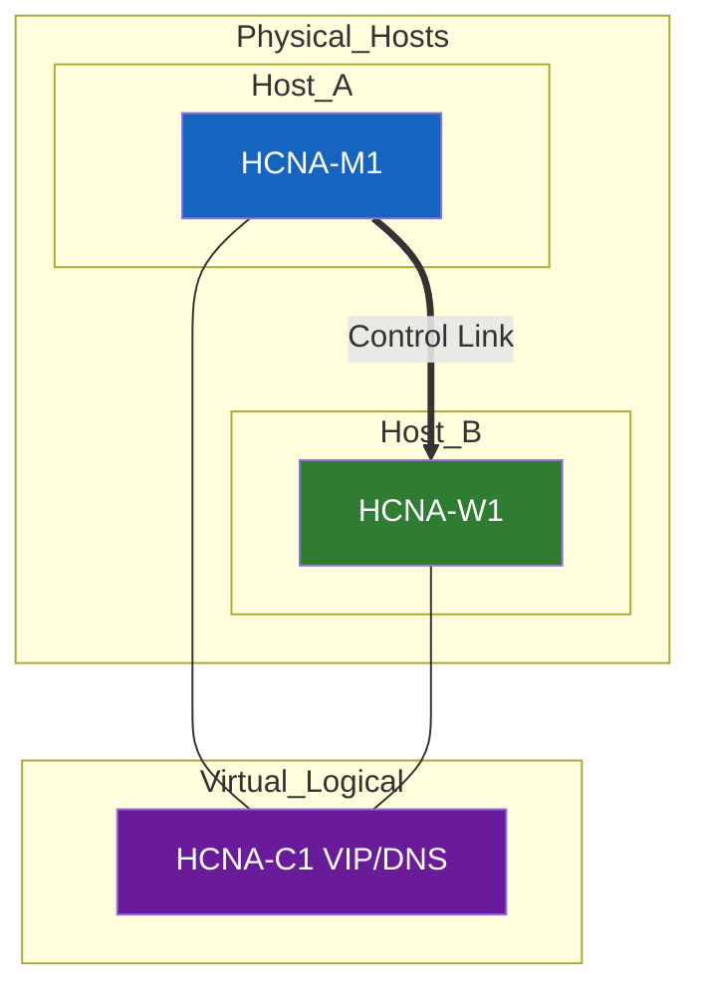

```mermaid
graph TD
  subgraph Physical_Hosts
    subgraph Host_A
      M1[HCNA-M1]
    end
    subgraph Host_B
      W1[HCNA-W1]
    end
  end

  subgraph Virtual_Logical
    C1[HCNA-C1 VIP/DNS]
  end

  M1 --- C1
  W1 --- C1
  M1 ==>|Control Link| W1

  style C1 fill:#6A1B9A,color:#fff
  style M1 fill:#1565C0,color:#fff
  style W1 fill:#2E7D32,color:#fff
```
