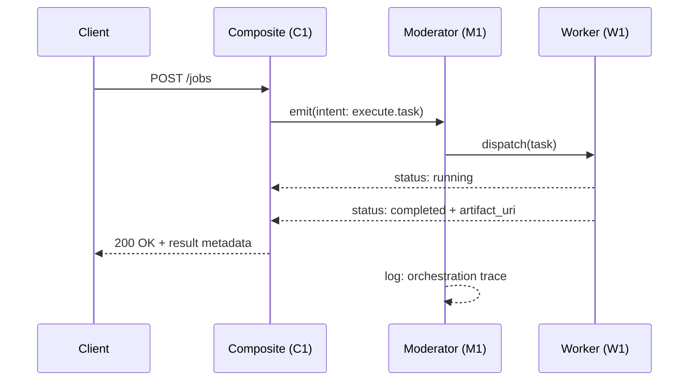

```mermaid
sequenceDiagram
  participant Client
  participant C1 as Composite (C1)
  participant M1 as Moderator (M1)
  participant W1 as Worker (W1)

  Client->>C1: POST /jobs
  C1->>M1: emit(intent: execute.task)
  M1->>W1: dispatch(task)
  W1-->>C1: status: running
  W1-->>C1: status: completed + artifact_uri
  C1-->>Client: 200 OK + result metadata
  M1-->>M1: log: orchestration trace
```
